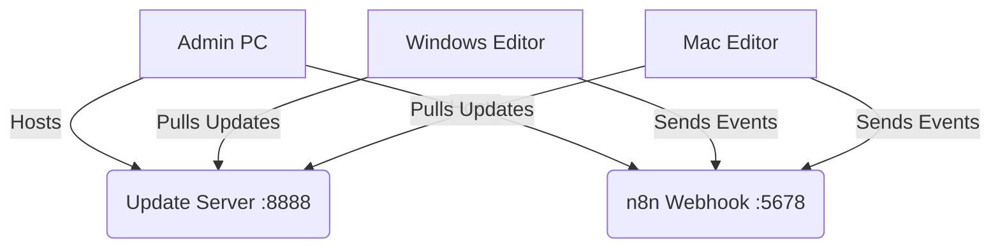

# 📡 Active Monitor System

A robust, cross-platform monitoring system for Editor PCs, tracking file activity, active applications, and Parsec connections. Designed for silent background operation and automated deployment.

## 🚀 Features

* **Background Operation**: Runs as a hidden system service (Windows) or LaunchAgent (macOS).
* **Auto-Update**: Clients automatically update from the central server.
* **Parsec Integration**: Real-time detection of connection/disconnection events.
* **Centralized Logging**: All events aggregated to an n8n webhook and Discord.

## 🛠️ System Architecture

## 📦 Deployment

The easiest way to install is via the internal Deployment Hub.

**Hub URL:** `http://192.168.1.171:8888`

### Quick Commands

| Platform | Command (Run in Terminal/PowerShell) |
| :--- | :--- |
| **Windows** | `Invoke-WebRequest "http://192.168.1.171:8888/deploy-windows.bat" -OutFile "$env:TEMP\deploy.bat"; Start-Process cmd.exe "/c $env:TEMP\deploy.bat" -Verb RunAs` |
| **macOS** | `curl -s <http://192.168.1.171:8888/file-monitor-mac.sh> | bash` |
| **Admin PC** | `Invoke-WebRequest "http://192.168.1.171:8888/setup-admin-pc.bat" -OutFile "$env:TEMP\setup.bat"; Start-Process cmd.exe "/c $env:TEMP\setup.bat" -Verb RunAs` |

## 📂 Project Structure

* `_Deployment/` - Source files distributed to clients.
* `docs/` - Detailed documentation and guides.
* `README.md` - This file.

## 🔗 Documentation

* [Deployment Walkthrough](docs/walkthrough.md)
* [Project Status](docs/project-status.md)
* [Rest API Logs](http://192.168.1.171:8080/logs)

---
*Maintained by Keshigami*
