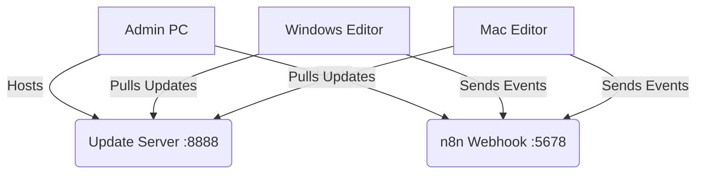

# 📡 Active Monitor System

A robust, cross-platform monitoring system for Editor PCs, tracking file activity, active applications, and Parsec connections. Designed for silent background operation and automated deployment.

## 🚀 Features

* **Background Operation**: Runs as a hidden system service (Windows) or LaunchAgent (macOS).
* **Auto-Update**: Clients automatically update from the central server.
* **Parsec Integration**: Real-time detection of connection/disconnection events.
* **Centralized Logging**: All events aggregated to an n8n webhook and Discord.

## 🛠️ System Architecture

## 📦 Deployment

The easiest way to install is via the internal Deployment Hub.

**Hub URL:** `http://192.168.1.171:8888`

### Quick Commands

| Platform | Command (Run in Terminal/PowerShell) |
| :--- | :--- |
| **Windows** | `Invoke-WebRequest "http://192.168.1.171:8888/deploy-windows.bat" -OutFile "$env:TEMP\deploy.bat"; Start-Process cmd.exe "/c $env:TEMP\deploy.bat" -Verb RunAs` |
| **macOS** | `curl -s <http://192.168.1.171:8888/file-monitor-mac.sh> | bash` |
| **Admin PC** | `Invoke-WebRequest "http://192.168.1.171:8888/setup-admin-pc.bat" -OutFile "$env:TEMP\setup.bat"; Start-Process cmd.exe "/c $env:TEMP\setup.bat" -Verb RunAs` |

## 📂 Project Structure

* `_Deployment/` - Source files distributed to clients.
* `docs/` - Detailed documentation and guides.
* `README.md` - This file.

## 🛡️ "Zero-Problem" Architecture

To ensure long-term stability and reliability (avoiding log bloat, freezes, or data loss), the system follows these strict rules:

1.  **Strict Exclusions**: All monitors automatically ignore "noise" files (`*.wdc`, `*.tmp`, `Render Files`, `Proxy`, `.plist`) to prevent `events.json` from exceeding limits.
2.  **Persistent Upgrades**: The `deploy-windows.bat` script automatically backs up your existing `events.json` before upgrading, so **logging history is never lost**.
3.  **Role-Based Logic**:
    *   **Admin PC**: Runs a strict monitor (excludes AI/Docker/Dev tools) to stay clean.
    *   **Editor PCs**: Run a permissive monitor (logs everything *except* render noise) to catch all user activity.
4.  **Task Separation**: Parsec monitoring runs in a separate process/thread from file monitoring to prevent UI freezing on Mac/Windows.

## 🔗 Documentation

* [Deployment Walkthrough](docs/walkthrough.md)
* [[Maintenance Guide]](docs/maintenance.md) (Read this if logs stop or system freezes)
* [Rest API Logs](http://192.168.1.171:8080/logs)

## ❓ Troubleshooting

**"Logs are empty or n8n failed"**
> Run the **Update Command** (above) on the affected machine. It will refresh the script with the latest "noise" filters without deleting your history.

**"Parsec is not logging"**
> The `ParsecMonitor` task runs separately from `FileMonitor`. Check if the "Parsec" app is producing a `log.txt` in its config folder.

---
*Maintained by Keshigami*
